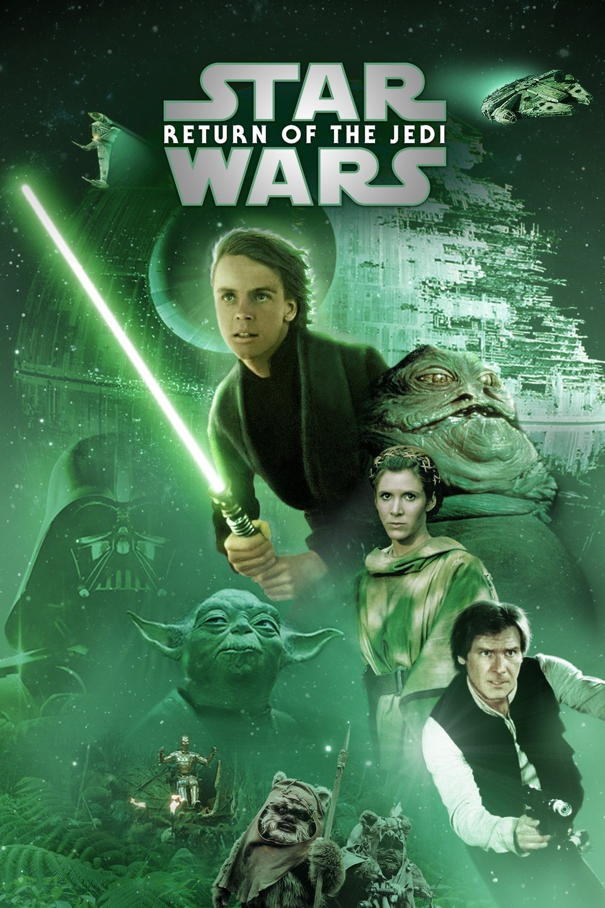
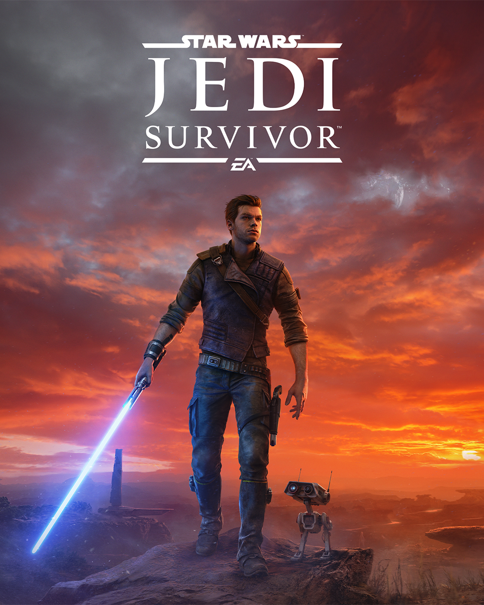
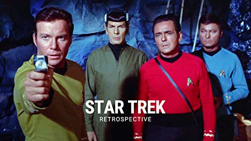

I am a fan of many things. Here are three of my favorites

Star Wars is a science fiction media franchise created by George Lucas. It began with the eponymous 1977 film and quickly became a worldwide pop-culture phenomenon. The franchise has been expanded into various films and other media, including television series, video games, novels, comic books, theme park attractions, and themed areas, comprising an all-encompassing fictional universe.The core films of the franchise were released between 1977 and 2005, and feature the Jedi, who use the Force for good, and the Sith, who use the dark side of the Force. The first film in the series, Star Wars, was released on May 25, 1977, and became a worldwide pop culture phenomenon, followed by four sequels. The prequel trilogy consists of the three prequel films released between 1999 and 2005. The original trilogy was re-released in theaters in the late 1990s and again in 2004, with the prequel trilogy released between 1999 and 2005. The film series has spawned an extensive media franchise called the Star Wars expanded universe including books, television series, computer and video games, and comic books, resulting in significant development of the series' fictional universe.Star Wars is a science fiction media franchise created by George Lucas. It began with the eponymous 1977 film and quickly became a worldwide pop-culture phenomenon. The franchise has been expanded into various films and other media, including television series, video games, novels, comic books, theme park attractions, and themed areas, comprising an all-encompassing fictional universe.

  

My favorite Star Wars movie is Return of the Jedi. Return of the Jedi is a 1983 American epic space-opera film directed by Richard Marquand. It is the third installment of the Star Wars franchise and the final installment of the original Star Wars trilogy. The film takes place one year after The Empire Strikes Back and follows the Rebel Alliance's attempt to free Han Solo from the crime lord Jabba the Hutt. The film features the return of Mark Hamill, Harrison Ford, and Carrie Fisher as Luke Skywalker, Han Solo, and Princess Leia Organa, respectively. In addition, it features the last appearances of actors Peter Mayhew, Anthony Daniels, and Kenny Baker as Chewbacca, C-3PO, and R2-D2, respectively.

Star Trek is an American science fiction television series created by Gene Roddenberry. The first television series, simply called Star Trek and now referred to as "The Original Series", debuted in 1966 and aired for three seasons on NBC.

Star Trek: The Next Generation is an American science fiction television series created by Gene Roddenberry as part of the Star Trek franchise. The series originally aired from 1987 to 1994 and follows the adventures of the crew of the USS Enterprise-D.
My favorite Star Trek movie is Star Trek: First Contact.

Role-playing games are a type of game in which players assume the roles of characters in a fictional setting. Players take on the roles of these characters and interact with each other and the world around them to create a story. Role-playing games can be played in person or online.
The most well-known RPG is Dungeons & Dragons.
Dungeons & Dragons is a fantasy tabletop role-playing game (RPG) originally designed by Gary Gygax and Dave Arneson. It was first published in 1974 by Tactical Studies Rules, Inc. (TSR). The game is set in a fictional world of sword and sorcery.
